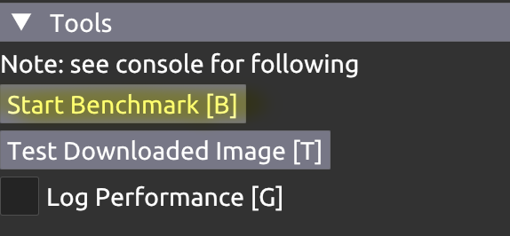

# vk_compute_mipmaps

This repository demonstrates a customizable cache-aware mipmap
generation algorithm using compute shaders. For power-of-2 textures,
this outperforms the conventional blit algorithm by about
50% (For a 4096x4096 sRGBA8 texture and an RTX 3090, the blit
algorithm took 161 microseconds vs 114 microseconds for the compute
shader).

**The most important component of this repository is the
`nvpro_pyramid` library, whose directory can be copied out and used
independent of this repository.** This provides a GLSL compute shader
template that only provides a "schedule" for mipmap generation, and
stub C++ code for dispatching the shader. The user completes the
shader by defining macros for loading, reducing, and storing samples,
adapting the shader to their own aplication's needs. There are no
dependencies besides standard C++ and Vulkan (in particular, it does
not depend on the `nvpro_core` framework, which the sample application
depends on).

Additionally, the repository contains a minimalist `nvpro_pyramid`
usage sample (`minimal_app`) along with a full sample application
(`demo_app`) that demonstrates some practical applications for fast
runtime mipmap generation and provides benchmarking functionality.


# Motivation

A common method to generate mipmaps is to perform level-by-level blits
with bilinear filters.  (i.e. blitting from level 0 to level 1,
inserting a barrier, blitting from level 1 to level 2, barrier, and so
on until the last mip level).

While simple to understand and implement, this method has some
objective weaknesses:

* The barriers introduce stalls into the queue for each blit: there is
  some overhead waiting for one blit to drain fully before starting
  the next.

* For realistic image sizes, the large low-numbered levels (where the
  bulk of work occurs) won't fit in cache. The samples written to
  level `N` are very likely to be evicted from cache before being read
  by the next blit (to level `N+1`).

Additional potential drawbacks (depending on use case) include:

* Blits cannot run on compute-only queues.

* Blits can only use a small number of built-in reduction functions
  (e.g. bilinear filtering). This is especially problematic for
  non-power-of-2 textures, which ideally (from an aesthetic standpoint)
  should use a 3-by-3 kernel.


# Library

The `nvpro_pyramid` library is concerned only with determining the
schedule for mipmap generation and leaves everything else up to the
user whenever possible. You can copy its directory out of this
repository and use it in your own project. The library can be
generalized to support general "image pyramid" algorithms, as long as
the reduction kernel is mipmap-like in that

* It can be separated into horizontal and vertical passes.

* The kernel size is 2x2 for even input images and 3x3 for odd.

**Requirements:**

* Vulkan 1.1+ and GLSL 4.50+ with `#include` support, no other
  mandatory extensions. However, [subgroup
  shuffle](https://www.khronos.org/blog/vulkan-subgroup-tutorial)
  support is needed for optimal performance.

* User defined macros for loading, reducing, and storing samples. In
  particular the user has total freedom in picking the image
  representation, sample type, and descriptor set layout.

* User must reserve 32 bits out of their push constant for the shader to use.

**Features:**

* No external dependencies; self-contained in `nvpro_pyramid` directory.

* No image size or divisibility requirements (barring `int` overflow).

* Example shader included for sRGBA8 mipmap generation.

* Non-power-of-2 support, using an
  [energy conserving 3x3 kernel](https://nvpro-samples.github.io/vk_compute_mipmaps/docs/strategy.md.html#generalpipeline);
  however, note that this has a
  [performance cost](https://nvpro-samples.github.io/vk_compute_mipmaps/docs/strategy.md.html#generalpipelineperformance/quality-performancetradeoff).

* Optional macros for performance tuning (e.g. using hardware bilinear
  filtering to replace shader code).

* Readable, commented GLSL code. You are invited to read the source code
  and adapt the demonstrated techniques for other purposes.

* Open source (see bottom for license).

**Files:**

* `nvpro_pyramid.glsl`: template shader; this file contains documentation
  on how to integrate the shader into your application.

* `nvpro_pyramid_dispatch.hpp`: Contains the `nvproCmdPyramidDispatch`
  C++ function that records suitable dispatch commands for the compute shader.

* `srgba8_mipmap_preamble.glsl`: Example macro definitions for configuring
  the shader for sRGBA8 mipmap generation.

* `srgba8_mipmap_fast_pipeline.comp` and `srgba8_mipmap_general_pipeline.comp`:
  example complete compute shaders for sRGBA8 mipmap generation.


# Sample Build and Run

(This is only needed for the full sample; the library shader does not
depend on any helper or build system).

Clone https://github.com/nvpro-samples/nvpro_core.git next to this
repository (or pull latest `master` if you already have it).  If there
are missing dependencies (e.g. glfw), run `git submodule update --init
--recursive --checkout --force` in the `nvpro_core` repository.

<!-- TODO may become `main` branch. -->

`mkdir build && cd build && cmake .. # Or use CMake GUI`

Then start the generated `.sln` in VS or run `make -j`.


# Parallelization Strategy

In the ideal power-of-2 case, observe that it's very easy to use
outputs immediately after they are generated, rather than storing them
to main memory and reloading them much later. For example, a 16x16
tile of the base mip level generates an 8x8 tile in level 1, which
itself can be used to generate a 4x4 tile in level 2, and so on. This
fact is used by the "fast pipeline" distributed with `nvpro_pyramid`,
which parallelizes each tile across many GPU threads. To communicate
results between threads, the fast pipeline mostly uses
[shuffles](https://www.khronos.org/blog/vulkan-subgroup-tutorial),
which allow threads in the same subgroup (warp) to peek at each
others' registers with minimal or no synchronization overhead.

Non-power-of-2 textures do not tile as cleanly, but the same
principles are still applied, with some complications, in the "general
pipeline", used whenever the fast pipeline is not applicable. In this
case, threads communicate using shared memory.

[More Details](https://nvpro-samples.github.io/vk_compute_mipmaps/docs/strategy.md.html)

This table provides RTX 3090 benchmark results, in nanoseconds, for
sRGBA8 mipmap generation on images of various sizes, to give an idea of
the speed of the library.

* `nvpro_pyramid`: using the `nvpro_pyramid` shader library

* `blit`: using one blit and one barrier for each level generated

* `onelevel`: using one compute dispatch and one barrier for each level generated

```
***********************************************************************
*                   key: nanosecond runtime (runtime relative to blit)*
*                                                                     *
*+----------------+----------------+----------------+----------------+*
*|     image size |  nvpro_pyramid |           blit |       onelevel |*
*+----------------+----------------+----------------+----------------+*
*|      1920,1080 |  36736 ( 80.6%)|  45568 (100.0%)|  46080 (101.1%)|*
*|                |  37632 ( 80.8%)|  46592 (100.0%)|  46848 (100.5%)|*
*+----------------+----------------+----------------+----------------+*
*|      2560,1440 |  43008 ( 72.3%)|  59520 (100.0%)|  60672 (101.9%)|*
*|                |  43648 ( 72.1%)|  60544 (100.0%)|  61440 (101.5%)|*
*+----------------+----------------+----------------+----------------+*
*|      3840,2160 |  75520 ( 80.3%)|  94080 (100.0%)|  96000 (102.0%)|*
*|                |  76288 ( 80.0%)|  95360 (100.0%)|  96768 (101.5%)|*
*+----------------+----------------+----------------+----------------+*
*|      2048,2048 |  35712 ( 57.2%)|  62464 (100.0%)|  62748 (100.5%)|*
*|                |  36480 ( 57.3%)|  63616 (100.0%)|  63488 ( 99.8%)|*
*+----------------+----------------+----------------+----------------+*
*|      4096,4096 | 112000 ( 70.1%)| 159744 (100.0%)| 159232 ( 99.7%)|*
*|                | 113024 ( 70.2%)| 161024 (100.0%)| 160128 ( 99.4%)|*
*+----------------+----------------+----------------+----------------+*
***********************************************************************
```


# Minimal Application

The `minimal_app` directory holds a sample that loads an image from
disk and generates and outputs mipmaps for it. Note that the vast
majority of time is spent on I/O (the speed of the `nvpro_pyramid`
library is intended more for real-time applications).

**The purpose of this sample is just to provide simple example code
  for `nvpro_pyramid` library usage, which may help you if integrating
  the library into your application is your goal.**

To run, select and run `vk_compute_mipmaps_minimal` in the solution
explorer or manually execute
`../../bin_x64/Release/vk_compute_mipmaps_minimal.exe`.

# Demo Application

See `demo_app` directory.

The demo application

* Demonstrates the speed of the `nvpro_pyramid` shader by using it to
  generate mipmaps for a huge dynamically-generated texture every frame.

* Provides a tool for benchmarking the `nvpro_pyramid` shader, blits,
  and alternative shaders rejected during development (or developed by
  the user!), and testing their output's correctness.

* Allows for choosing between these alternative mipmap generators at
  runtime and immediately seeing their effects.

To run, select and run `vk_compute_mipmaps_demo` in the solution
explorer or manually execute
`../../bin_x64/Release/vk_compute_mipmaps_demo.exe`.

## Huge Texture

The sample dynamically generates a huge texture based on a [quadratic
polynomial Julia
Set](https://en.wikipedia.org/wiki/Julia_set#Quadratic_polynomials)
with varying constant coefficient, and generates mipmaps for it
dynamically, before using it to texture the screen (in 2D camera mode)
or the ground (in 3D camera mode). This is meant as a stand-in for any
sort of dynamically-generated texture a production application might
create, e.g. a reflection map, that may have to be sampled at multiple
levels-of-detail.

## Benchmarking Utility & Alternative Shaders

The benchmarking utility compares the performance and correctness of
the default `nvpro_core` shader, blits, and alternative shaders, using
a variety of test images. This, along with the "mipmap algorithm"
menu, can be used to

* [Quantify the effects of omitting various optimizations and
  techniques used by the provided mipmap
  shader](https://nvpro-samples.github.io/vk_compute_mipmaps/docs/strategy.md.html#fastpipelineperformance)

* [Allow you to benchmark your own custom fast or general pipelines
  and compare with the provided shader](https://nvpro-samples.github.io/vk_compute_mipmaps/docs/alternatives.md.html)

The Benchmark results are written in JSON format. When the sample is run in
Visual Sample, the benchmark results seem to be written to `build/demo_app`
(assuming the CMake build directory is named `build` as suggested).



# Test Images

There are some test images in the `test_images` directory. Many test
pathological cases, e.g. `4095.jpg` tests the "worst-case"
one-less-than-a-power-of-2 case with high-frequency information.

These images are either photographed or computer generated by me,
and have the same license as the code sample. `4096.jpg` and similar
images are based on a chaotic quadratic polynomial found by my college
roommate, Marlon Trifunovic.


# Acknowledgement

Thank you to Pascal Gautron, Christoph Kubisch, and Martin-Karl
Lefrançois for review; Christoph also provided the outline for the
`fastPipeline` shader and optimization suggestions.


# License

<!-- Note: LICENSE duplicated in nvpro_pyramid/ directory, in case it's copied out alone-->
Copyright 2021 NVIDIA CORPORATION. Released under Apache License,
Version 2.0. See "LICENSE" file for details.